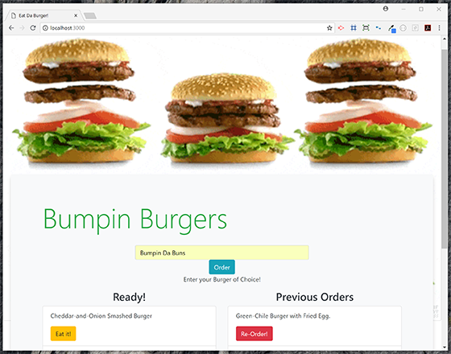

# 🍔 Eat-Da-Burger 🍔
Bumpin Burgers is a Restaurant App that lets you - *Choose your Burger &amp; Eat it Too!*

### 🍔Description
Bumpin Burgers demonstrates a simple full stack application with a front end implemented with HTML and the backend implemented with Node.js and Express.  HTML templating is done with the help of Handlebars.

The user may enter a burger of choice to add it to the *Order*. This also adds the new burger entry into the MySQL database. This burger is added as *Ready!* on the menu and placed on the left side of the screen. The user may then *Eat* any burger by clicking on it, which moves it into the *Previous Orders* column and updates its status accordingly in the database.
The burgers in the *Previous Orders* can also be ordered again.

Further improvements could be made by adding a *Delete* button to clean up the *Previous Orders* column.

### 🍔Technologies

* HTML
* Javascript
* Node.js
* Express.js
* Handlebars
* MySQL
* ORM
* MVC
* NPM Packages
    1. Express
    2. Method-override
    3. Body-parser
    4. Express-handlebars
    5. mySql
    6. Handlebars-helper-css

### 🍔**[Demo](https://guarded-reaches-61413.herokuapp.com/)**